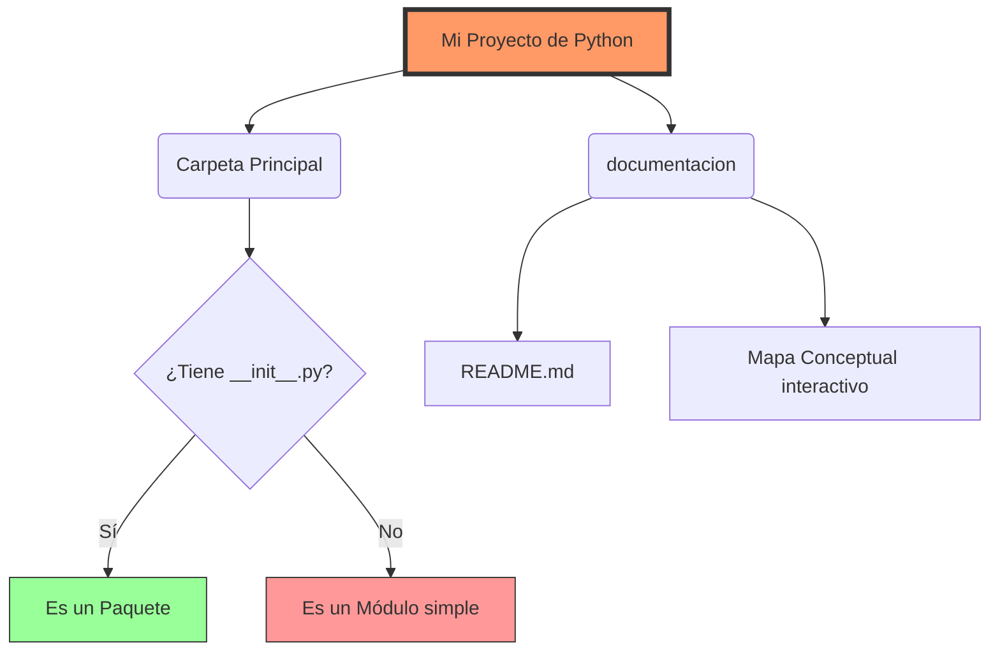

```mermaid
graph TD
    %% Definición de nodos y conexiones
    A[Mi Proyecto de Python] --> B(Carpeta Principal)
    A --> C(documentacion)
    
    B --> D{¿Tiene __init__.py?}
    D -- Sí --> E[Es un Paquete]
    D -- No --> F[Es un Módulo simple]
    
    C --> G[README.md]
    C --> H[Mapa Conceptual interactivo]

    %% Estilos (Colores)
    style A fill:#f96,stroke:#333,stroke-width:4px
    style E fill:#9f9,stroke:#333
    style F fill:#f99,stroke:#333
```

